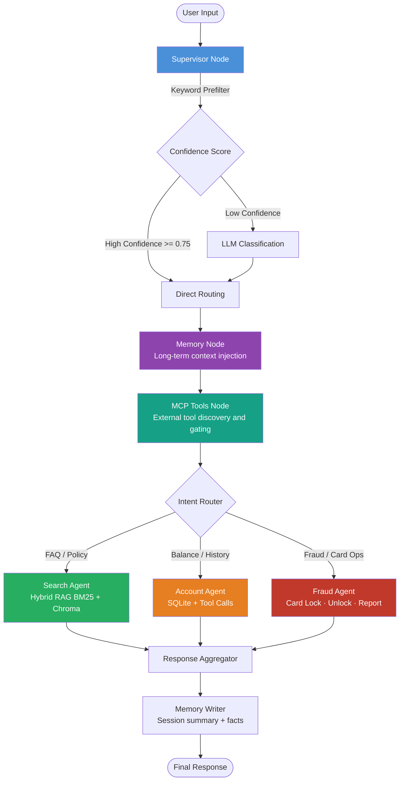
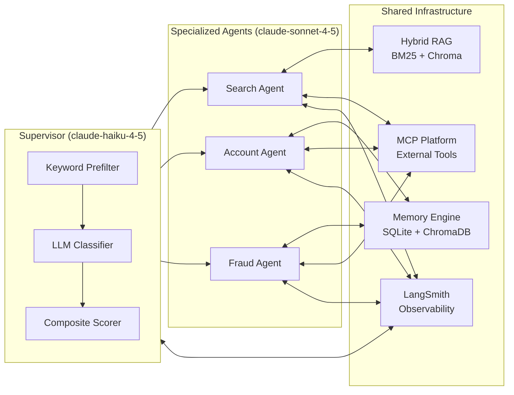

# AI Agent for Banking Support

[](https://www.python.org/)
[](https://github.com/vivanvj21/AI_Agent_for_Banking_Support/actions/workflows/ci.yml)
[](https://langchain-ai.github.io/langgraph/)
[](https://www.anthropic.com/)
[](https://fastapi.tiangolo.com/)
[](https://streamlit.io/)
[](https://www.docker.com/)
[](https://smith.langchain.com/)
[](LICENSE)

> **An Autonomous, Multi-Agent Banking Support Assistant** — built on LangGraph state-machine orchestration, Hybrid RAG (BM25 + ChromaDB), enterprise memory, and full LLM observability. Handles customer queries, account operations, and fraud management through three specialized AI agents coordinated by an intelligent supervisor.

---

## Table of Contents

- [Overview](#overview)
- [Architecture](#architecture)
- [Key Features](#key-features)
- [Tech Stack](#tech-stack)
- [Repository Structure](#repository-structure)
- [Installation](#installation)
- [Quick Start](#quick-start)
- [Configuration](#configuration)
- [API Reference](#api-reference)
- [Demo Users](#demo-users)
- [Docker Deployment](#docker-deployment)
- [Observability](#observability)
- [Evaluation](#evaluation)
- [Screenshots](#screenshots)
- [Roadmap](#roadmap)
- [Contributing](#contributing)

---

## Overview

This project is a production-grade, autonomous banking support system developed across **10 engineering phases** — from core agent orchestration to enterprise hybrid RAG, observability, evaluation, memory, deployment, MCP tool integration, and documentation.

The system accepts natural language queries from customers and routes them intelligently through a multi-agent pipeline. Sensitive operations (balance lookups, card locks, fraud reports) require identity verification enforced at the Python level — **never exposed to the LLM** — as a hard architectural defense against prompt injection.

### Development Phases

| Phase | Focus | Status |
|-------|-------|--------|
| 1 | Production Hardening | ✅ Complete |
| 2 | Enterprise Hybrid RAG | ✅ Complete |
| 3 | LangSmith Observability | ✅ Complete |
| 4 | RAGAS Evaluation Harness | ✅ Complete |
| 5 | AI Platform Layer | ✅ Complete |
| 6 | Memory & Context Engine | ✅ Complete |
| 7 | Production Deployment (Docker) | ✅ Complete |
| 8 | Intelligent Orchestration | ✅ Complete |
| 9 | MCP Platform Integration | ✅ Complete |
| 10 | Documentation & Polish | ✅ Complete |
| 11 | Production Cleanup & Security Hardening | ✅ Complete |
| 12 | Enterprise Production System (Postgres, Redis, Gunicorn, Nginx, Prometheus, Grafana, JWT, Scripts) | ✅ Complete |

---

## Architecture

### Graph Flow

The LangGraph state machine executes nodes in the following order for every request:



### Agent Collaboration Model



---

## Key Features

### 1. Intelligent Supervisor with Confidence-Based Routing
- **Keyword prefilter** eliminates unnecessary LLM calls for clear-cut intents
- **LLM classification** (`claude-haiku-4-5`) for ambiguous queries — chosen for low cost and low latency
- **Composite confidence score** (keyword signal + LLM posterior) gates routing decisions
- Configurable `ORCH_HIGH_CONF` threshold (default `0.75`) for direct-routing bypass of LLM

### 2. Hybrid RAG — BM25 + ChromaDB
- Sparse BM25 retrieval over FAQ/policy knowledge base for lexical precision
- Dense vector search via ChromaDB (VoyageAI embeddings, optional) for semantic recall
- Result fusion and re-ranking before answer synthesis
- Knowledge base documents in `knowledge_base/` — fully hot-swappable

### 3. Enterprise Memory & Context Engine
- **Long-term facts** stored and retrieved from SQLite across sessions
- **Session summaries** generated after every conversation turn
- **Semantic retrieval** using ChromaDB for "what did the user ask before about X?"
- Memory is injected into agent context before every response, personalized per user

### 4. MCP Platform (Model Context Protocol)
- External tool servers defined in `mcp_servers/` (account, FAQ, fraud)
- MCP Manager handles auto-discovery, subprocess spawning, lifecycle management
- **Confidence-gated execution**: tools only invoked when supervisor score >= `MCP_MIN_CONFIDENCE`
- Registry-based selector matches active tools to resolved intent

### 5. Security — Verification as Hard Code
- Identity verification (user ID + PIN) is enforced in **pure Python**, never delegated to an LLM tool
- Prevents prompt injection attacks that could trick the model into skipping auth
- Verification gate is called before every sensitive operation (balance, card lock, fraud report)

### 6. Full LangSmith Observability
- Every LangGraph node is traced with LangSmith
- Parent/child span hierarchy preserved for the full multi-agent graph
- Configurable via `LANGSMITH_TRACING=true` — zero overhead when disabled

### 7. RAGAS Automated Evaluation
- Evaluation harness in `evaluation/` powered by [RAGAS](https://docs.ragas.io/)
- Measures: **Faithfulness**, **Answer Relevance**, **Context Precision**, **Answer Correctness**
- Run against the live graph to catch regressions before deployment

### 8. Three Interfaces

| Interface | Command | Use Case |
|-----------|---------|----------|
| CLI | `python start.py cli` | Development, debugging, demos |
| Streamlit Web UI | `python start.py streamlit` | Non-technical stakeholders |
| FastAPI REST | `python start.py api` | Production integrations, mobile clients |

---

## Tech Stack

| Layer | Technology | Purpose |
|-------|-----------|---------|
| Orchestration | LangGraph | State-machine multi-agent graph |
| LLM — Primary | Anthropic Claude Sonnet 4.5 | Agent reasoning & response synthesis |
| LLM — Classifier | Anthropic Claude Haiku 4.5 | Fast, cheap intent classification |
| Vector Store | ChromaDB & pgvector | Dense retrieval for RAG and Memory |
| Sparse Retrieval | BM25 (rank-bm25) | Lexical FAQ search |
| Embeddings | VoyageAI (optional) | High-quality text embeddings |
| Primary Database | PostgreSQL (SQLAlchemy ORM + Alembic) | Enterprise relational storage & migrations |
| Caching & Locks | Redis Cluster | Distributed cache, Redlock locks, sessions, rate limiting |
| Application Server | Gunicorn + Uvicorn Async Workers | Production ASGI server with worker recycling |
| Edge Reverse Proxy | Nginx | SSL termination, security headers, rate limit zones |
| REST API | FastAPI | Production HTTP interface |
| Web UI | Streamlit | Browser-based chat interface |
| External Tools | MCP (Model Context Protocol) | Subprocess tool servers |
| Observability & Metrics | Prometheus & Grafana & LangSmith | System metrics, tracing, span hierarchy |
| Evaluation | RAGAS | LLM quality metrics |
| Containerization | Docker + docker-compose | Multi-stage production builds |

---

## Repository Structure

```
AI Agent for Banking Support/
│
├── agents/                     # Agent implementations
│   ├── supervisor.py           # Confidence-based router
│   ├── search_agent.py         # FAQ/RAG agent
│   ├── account_agent.py        # Balance/history agent
│   ├── fraud_agent.py          # Card lock/unlock/report agent
│   ├── registry.py             # Agent registry & factory
│   ├── confidence.py           # Scoring logic
│   ├── prompt_builder.py       # Dynamic prompt construction
│   └── collaborator.py         # Cross-agent coordination
│
├── api/                        # FastAPI application
│   └── ...                     # Route handlers, middleware, schemas
│
├── db/                         # Database layer
│   ├── schema.sql              # SQLite table definitions
│   └── init.py                 # DB initialization & seeding
│
├── docs/                       # Architecture documentation
│
├── evaluation/                 # RAGAS evaluation harness
│
├── knowledge_base/             # FAQ and policy documents (RAG source)
│
├── memory/                     # Memory Engine
│   ├── models.py               # Data models (Fact, Summary)
│   ├── store.py                # SQLite persistence layer
│   ├── retriever.py            # Semantic retrieval via ChromaDB
│   └── summarizer.py           # Session summarization logic
│
├── mcp_platform/               # Model Context Protocol platform
│   ├── manager.py              # MCP server lifecycle manager
│   ├── registry.py             # Tool registry
│   ├── client.py               # MCP client wrapper
│   ├── executor.py             # Confidence-gated tool execution
│   └── selector.py             # Intent-to-tool matching
│
├── mcp_servers/                # FastMCP server definitions
│   ├── account_server.py       # Account info MCP server
│   ├── faq_server.py           # FAQ search MCP server
│   └── fraud_server.py         # Fraud operations MCP server
│
├── observability/              # LangSmith integration
│
├── tests/                      # Test suite
│
├── tools/                      # LangChain-compatible tool definitions
│   ├── account_tools.py
│   ├── fraud_tools.py
│   ├── faq_search.py
│   ├── embeddings.py
│   └── memory.py
│
├── app_streamlit.py            # Streamlit web UI entry point
├── cli.py                      # Interactive CLI entry point
├── config.py                   # Centralized runtime configuration
├── graph.py                    # LangGraph state machine definition
├── logging_config.py           # Structured logging setup
├── requirements.txt            # Python dependencies
└── start.py                    # Unified launcher (cli / streamlit / api)
```

---

## Installation

### Prerequisites

- Python 3.12+
- `pip` (or `uv` / `pipx`)
- Docker & Docker Compose (optional, for containerized deployment)
- An [Anthropic API key](https://console.anthropic.com/)

### Steps

```bash
# 1. Clone the repository
git clone <repo-url>
cd "AI Agent for Banking Support"

# 2. Create and activate a virtual environment
python -m venv .venv
# Windows
.venv\Scripts\activate
# macOS/Linux
source .venv/bin/activate

# 3. Install dependencies
pip install -r requirements.txt

# 4. Configure environment
cp .env.example .env
# Open .env and set at minimum: ANTHROPIC_API_KEY

# 5. Initialize the database (creates SQLite DB and seeds demo users)
python db/init.py
```

---

## Quick Start

```bash
# Interactive CLI (best for development and demos)
python start.py cli

# Streamlit web interface (browser-based chat)
python start.py streamlit

# FastAPI REST server (production API)
python start.py api

# Docker (all-in-one production stack)
docker compose up --build
```

Once the FastAPI server is running, the auto-generated docs are available at:
- **Swagger UI**: `http://localhost:8000/docs`
- **ReDoc**: `http://localhost:8000/redoc`

---

## Configuration

All configuration is managed via environment variables (`.env` file).

### Core Settings

| Variable | Required | Default | Description |
|----------|----------|---------|-------------|
| `ANTHROPIC_API_KEY` | **Yes** | — | Anthropic API key for Claude models |
| `ANTHROPIC_MODEL` | No | `claude-sonnet-4-5` | Primary model for agents |

### Orchestration Settings

| Variable | Required | Default | Description |
|----------|----------|---------|-------------|
| `ORCH_SUPERVISOR_MODEL` | No | `claude-haiku-4-5` | Model used by supervisor for intent classification |
| `ORCH_HIGH_CONF` | No | `0.75` | Confidence threshold for bypassing LLM classifier |

### MCP Platform Settings

| Variable | Required | Default | Description |
|----------|----------|---------|-------------|
| `MCP_MIN_CONFIDENCE` | No | `0.60` | Minimum confidence score to allow MCP tool execution |
| `MCP_DISABLED_SERVERS` | No | — | Comma-separated list of MCP server names to disable |

### Observability Settings

| Variable | Required | Default | Description |
|----------|----------|---------|-------------|
| `LANGSMITH_TRACING` | No | `false` | Enable/disable LangSmith tracing |
| `LANGSMITH_API_KEY` | No | — | LangSmith API key (required if tracing enabled) |
| `LANGSMITH_PROJECT` | No | `banking-support` | LangSmith project name for trace grouping |

### Embeddings & RAG Settings

| Variable | Required | Default | Description |
|----------|----------|---------|-------------|
| `VOYAGE_API_KEY` | No | — | VoyageAI API key (falls back to local embeddings if unset) |
| `CHROMA_PERSIST_DIR` | No | `./chroma_db` | ChromaDB persistence directory |

---

## API Reference

Base URL: `http://localhost:8000`

### Chat & Verification

| Method | Endpoint | Description |
|--------|----------|-------------|
| `POST` | `/chat` | Send a natural language message; receives agent response |
| `POST` | `/verify` | Verify user identity (user ID + PIN) |

### Account Operations

| Method | Endpoint | Description |
|--------|----------|-------------|
| `POST` | `/account/balance` | Get account balance (requires verification) |
| `POST` | `/account/history` | Get transaction history (requires verification) |

### Fraud Operations

| Method | Endpoint | Description |
|--------|----------|-------------|
| `POST` | `/fraud/lock-card` | Lock a debit/credit card (requires verification) |
| `POST` | `/fraud/report` | Report a fraudulent transaction (requires verification) |

### FAQ / Knowledge Base

| Method | Endpoint | Description |
|--------|----------|-------------|
| `POST` | `/faq/search` | Search the knowledge base with a query string |

### Health Checks

| Method | Endpoint | Description |
|--------|----------|-------------|
| `GET` | `/health` | Full health status (all components) |
| `GET` | `/health/live` | Liveness probe (for Kubernetes/Docker) |
| `GET` | `/health/ready` | Readiness probe (checks DB, Chroma, LLM connectivity) |

### MCP Platform

| Method | Endpoint | Description |
|--------|----------|-------------|
| `GET` | `/mcp/status` | Status of all registered MCP servers |
| `GET` | `/mcp/tools` | List all available MCP tools |
| `GET` | `/mcp/tools/{intent}` | List MCP tools matching a given intent |
| `POST` | `/mcp/call` | Directly invoke an MCP tool by name |

### Monitoring

| Method | Endpoint | Description |
|--------|----------|-------------|
| `GET` | `/metrics` | Application metrics (request counts, latencies) |

### Example: `/chat` Request

```bash
curl -X POST http://localhost:8000/chat \
  -H "Content-Type: application/json" \
  -d '{
    "user_id": "U1001",
    "session_id": "sess-abc123",
    "message": "What is my account balance?"
  }'
```

```json
{
  "response": "To retrieve your balance, I need to verify your identity. Please provide your PIN.",
  "intent": "account_balance",
  "confidence": 0.92,
  "agent": "account_agent",
  "session_id": "sess-abc123"
}
```

---

## Demo Users

The database is seeded with three demo users for immediate testing. **Do not use these credentials in production.**

| User ID | PIN | Account Type | Seeded Balance |
|---------|-----|-------------|----------------|
| `U1001` | `1111` | Checking | $5,200.00 |
| `U1002` | `2222` | Savings | $12,800.00 |
| `U1003` | `3333` | Checking | $850.00 |

---

## Docker Deployment

### Production Stack

```bash
# Build and start all services
docker compose up --build

# Run in background
docker compose up --build -d

# View logs
docker compose logs -f

# Tear down
docker compose down
```

### Development Stack (Hot Reload)

```bash
docker compose -f docker-compose.yml -f docker-compose.dev.yml up
```

### Services

| Service | Port | Description |
|---------|------|-------------|
| `api` | `8000` | FastAPI REST server |
| `streamlit` | `8501` | Streamlit web UI |
| `chroma` | `8002` | ChromaDB vector store |

### Health Check Endpoints

```
http://localhost:8000/health/live    # Liveness probe
http://localhost:8000/health/ready   # Readiness probe
```

---

## Observability

### LangSmith Tracing

Enable tracing by setting the following in `.env`:

```env
LANGSMITH_TRACING=true
LANGSMITH_API_KEY=your-key-here
LANGSMITH_PROJECT=banking-support
```

Every LangGraph node execution — supervisor classification, memory injection, MCP tool calls, agent reasoning, and response synthesis — is captured as a named span in LangSmith. Traces include:

- Input/output for every node
- Token usage and latency per span
- Confidence scores at routing decision points
- Parent/child hierarchy matching the graph topology

Visit [smith.langchain.com](https://smith.langchain.com) to explore traces.

---

## Evaluation

### Running RAGAS Evaluation

```bash
# Run the full evaluation suite
python -m evaluation.run_eval

# Run against a specific test set
python -m evaluation.run_eval --dataset evaluation/test_sets/faq_queries.json
```

### Metrics Tracked

| Metric | Description |
|--------|-------------|
| **Faithfulness** | Does the answer stay faithful to retrieved context? |
| **Answer Relevance** | Is the answer relevant to the question asked? |
| **Context Precision** | Are the retrieved chunks actually useful? |
| **Answer Correctness** | Is the answer factually correct vs. ground truth? |

Results are written to `evaluation/results/` as JSON and CSV for historical comparison.

---

## Screenshots

> **Note:** The following sections are placeholders for interface screenshots. Run the application locally to see the live UI.

### Streamlit Web UI
*Chat interface with session history, user verification flow, and real-time agent responses.*
<!-- Add screenshot: docs/screenshots/streamlit_chat.png -->

### CLI Interface
*Interactive terminal with colored output, intent labels, and confidence scores displayed per response.*
<!-- Add screenshot: docs/screenshots/cli_demo.png -->

### LangSmith Trace View
*Full span hierarchy for a multi-hop fraud report query, showing supervisor → memory → fraud agent spans.*
<!-- Add screenshot: docs/screenshots/langsmith_trace.png -->

### FastAPI Swagger Docs
*Auto-generated OpenAPI documentation at `/docs` with all endpoint schemas.*
<!-- Add screenshot: docs/screenshots/api_docs.png -->

---

## Security Model & Known Limitations

### Security Architecture (Verified)
- **Structured Authentication**: Identity verification uses explicit `auth_user_id` and `auth_pin` payload fields; raw PINs are purged from graph memory before LLM context generation or tracing.
- **Account Lockout**: 5 failed verification attempts trigger a 15-minute temporary account lockout enforced atomically in SQLite (`failed_attempts`, `locked_until`).
- **Argon2id Hashing**: Demo PINs are securely hashed using Argon2id with automatic timing-attack mitigation.
- **CORS Hardening**: Centralized origin whitelist with explicit wildcard `*` rejection when credentials are enabled.
- **API Rate Limiting**: Thread-safe sliding-window rate limiter guarding `/chat`, `/verify`, `/account/*`, `/fraud/*`, and `/faq/*`.
- **SecretStr Encapsulation**: Secrets (`ANTHROPIC_API_KEY`, `VOYAGE_API_KEY`, `LANGSMITH_API_KEY`) wrapped in redacting `SecretStr` types. SHA-256 fingerprinting tracks non-sensitive configuration drift.
- **Fixed-Point Money Storage**: All financial balances (`balance_paise`) and transaction amounts (`amount_paise`) stored as integer minor units. Migration preserves foreign keys (`PRAGMA foreign_key_check` pre-commit), triggers, sequence states, and emits auditable normalization logs for NULL values.

### Known Architectural Limitations
1. **Single-Factor Authentication**: Verification relies on a 4-digit PIN. Enterprise deployment requires multi-factor authentication (MFA).
2. **Perimeter API Authentication**: Public REST endpoints are protected by standard header-based API Key (`X-API-Key`) perimeter authentication with constant-time comparison (`secrets.compare_digest`). Enterprise OAuth2/JWT gateway integration is recommended for multi-tenant production setups.
3. **Single-Node Database & Vector Store**: SQLite and in-memory ChromaDB are single-process by construction. Horizontal scaling requires PostgreSQL (documented in `docs/POSTGRES_MIGRATION.md`) and a clustered vector store.
4. **Local Subprocess MCP Transport**: MCP tools run over stdio subprocesses (~200ms overhead). Networked MCP services are required for distributed setups.

## Continuous Integration (CI)

Automated testing and code validation are enforced via GitHub Actions ([.github/workflows/ci.yml](.github/workflows/ci.yml)).

- **Triggers**: Runs on all pushes (`branches: ["**"]`), pull requests targeting `main`, and manual dispatch (`workflow_dispatch`).
- **Concurrency**: Automatically cancels outdated in-flight runs on the same branch (`concurrency: cancel-in-progress`).
- **Environment**: Runs on `ubuntu-latest` with Python 3.12, using non-secret test settings (`ENV=testing`, `PERIMETER_AUTH_OPT_OUT=true`). Zero external LLM calls or cloud production secrets are used in CI runs.
- **Local Reproduction**: Developers can run the exact same checks locally:
  ```bash
  python -m compileall -q .
  python -m pytest
  python cli.py --check-startup
  ```

> [!NOTE]
> **Automated Testing vs. Deployment (CD)**: GitHub Actions CI automatically validates code compilation, test suite execution, and system health checks. Continuous Deployment (CD) / automated container pushing to staging or production is **not yet implemented**.

---

## Current State and Next Steps

The repository has completed **Phase 12 (Perimeter API Authentication & Regression Resolution)** with **250/250 tests passing**.

### Prioritized Next Steps
1. **Adaptive Authentication & Enterprise IAM (Phase 13)**: Replace single-factor PIN lookup with signed JWTs (Okta / Auth0 / AWS Cognito) and step-up authentication for high-risk actions (card locking, fraud reporting).
2. **PostgreSQL Migration (Phase 14)**: Execute the PostgreSQL migration plan detailed in [docs/POSTGRES_MIGRATION.md](docs/POSTGRES_MIGRATION.md).

---

## Roadmap

| Phase | Feature | Status / Priority |
|-------|---------|-------------------|
| 11 | Production Cleanup & Security Hardening (Steps 1, 2, A, B, D, E, F) | ✅ Complete |
| 12 | Perimeter API Gateway & Authentication | ⏳ Next Priority |
| 13 | Enterprise IAM & Adaptive Auth (OAuth2 / JWT) | High |
| 14 | PostgreSQL Migration & Shared Redis Rate Limiting | Medium |
| 15 | Networked MCP Transport | Medium |
| 16 | CI/CD Pipeline (GitHub Actions & Container Registry) | Medium |

---

## Contributing

Contributions are welcome. Please follow these steps:

1. Fork the repository
2. Create a feature branch: `git checkout -b feature/your-feature-name`
3. Make your changes with appropriate tests in `tests/`
4. Ensure all tests pass: `python -m pytest tests/`
5. Open a pull request with a clear description of changes

### Code Style

- **Formatter**: `black` (line length 100)
- **Linter**: `ruff`
- **Type hints**: Required on all public functions
- **Docstrings**: Google style

---

## License

This project is licensed under the [MIT License](https://opensource.org/licenses/MIT).

---

## Acknowledgements

- [LangChain / LangGraph](https://github.com/langchain-ai/langgraph) — Multi-agent orchestration framework
- [Anthropic](https://www.anthropic.com/) — Claude language models
- [ChromaDB](https://www.trychroma.com/) — Open-source vector database
- [RAGAS](https://docs.ragas.io/) — RAG evaluation framework
- [FastAPI](https://fastapi.tiangolo.com/) — Modern Python web framework
- [Streamlit](https://streamlit.io/) — Rapid ML app development

---

<p align="center">
  Built with precision across 10 engineering phases &nbsp;·&nbsp; Designed for production banking workloads
</p>
