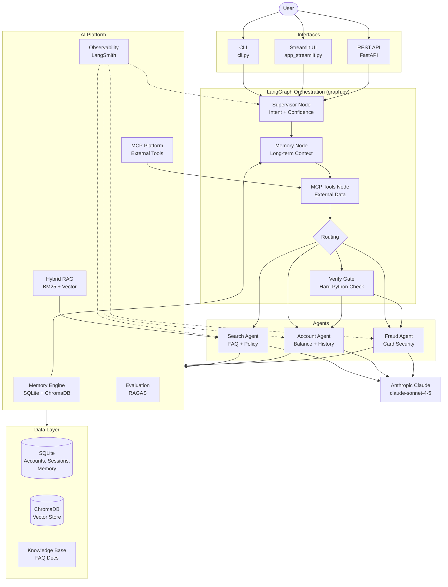

# Architecture Overview

> **AI Agent for Banking Support** — a production-grade, multi-agent banking assistant built on LangGraph.

---

## Table of Contents

1. [High-Level Architecture](#high-level-architecture)
2. [System Components](#system-components)
3. [Data Flow](#data-flow)
4. [Request Lifecycle](#request-lifecycle)
5. [Memory Flow](#memory-flow)
6. [RAG Flow](#rag-flow)
7. [MCP Flow](#mcp-flow)
8. [Deployment Architecture](#deployment-architecture)

---

## High-Level Architecture



---

## System Components

### Interfaces (3)

| Component | File | Description |
|-----------|------|-------------|
| **CLI** | `cli.py` | Interactive terminal loop; supports `--resume`, `--check-startup`, `--list-sessions` |
| **Streamlit UI** | `app_streamlit.py` | Browser-based chat interface with session state |
| **REST API** | `api/` | FastAPI application with 15 endpoints, health probes, and MCP routes |

### Orchestration

| Component | File | Description |
|-----------|------|-------------|
| **Graph** | `graph.py` | LangGraph `StateGraph`; defines 9 nodes and all conditional edges |
| **AgentState** | `agents/state.py` | Shared `TypedDict`; carries messages, intent, routing decision, memory, MCP context |

### Intelligent Supervisor (Phase 8)

| Component | File | Description |
|-----------|------|-------------|
| **Supervisor** | `agents/supervisor.py` | 3-stage pipeline: keyword prefilter → LLM → composite confidence |
| **Registry** | `agents/registry.py` | `AgentCapability` descriptors for each agent |
| **Confidence** | `agents/confidence.py` | Scoring: keyword overlap × LLM confidence × context boost |
| **Prompt Builder** | `agents/prompt_builder.py` | Centralized prompt construction; memory injection; token budgeting |
| **Orchestration Config** | `agents/orchestration_config.py` | Env-overridable routing thresholds and fallback rules |
| **Collaborator** | `agents/collaborator.py` | Multi-agent assist: fraud→search, fraud→account |

### Agents (3)

| Agent | File | Intent | Requires Auth | Tools |
|-------|------|--------|---------------|-------|
| **Search** | `agents/search_agent.py` | `search` | No | `search_faq` |
| **Account** | `agents/account_agent.py` | `account` | Yes | `get_balance`, `get_transaction_history` |
| **Fraud** | `agents/fraud_agent.py` | `fraud` | Yes | `lock_card`, `unlock_card`, `report_card_lost`, `report_fraud_transaction`, `get_flagged_transactions` |

### Memory Engine (Phase 6)

| Component | File | Description |
|-----------|------|-------------|
| **Manager** | `memory/manager.py` | `MemoryManager` façade; `get_context()`, `record_turn()` |
| **Store** | `memory/store.py` | SQLite persistence for facts, sessions, turns |
| **Ranker** | `memory/ranking.py` | Recency + relevance scoring for memory retrieval |
| **Semantic Store** | `memory/semantic_store.py` | ChromaDB-backed semantic fact retrieval |
| **Retriever** | `memory/retriever.py` | Combines SQL facts + semantic search |
| **Summarizer** | `memory/summarizer.py` | LLM-based conversation summarization |
| **Context Builder** | `memory/context_builder.py` | Assembles `ContextPackage` for each turn |

### MCP Platform (Phase 9)

| Component | File | Description |
|-----------|------|-------------|
| **Manager** | `mcp_platform/manager.py` | `MCPManager` singleton; plan + execute + format |
| **Registry** | `mcp_platform/registry.py` | Live catalog of servers and tools |
| **Client** | `mcp_platform/client.py` | Stdio transport wrapper; retry + timeout |
| **Discovery** | `mcp_platform/discovery.py` | Auto-discovers tools via `list_tools()` at startup |
| **Executor** | `mcp_platform/executor.py` | Normalized `ToolResult`; feeds results to Memory |
| **Selector** | `mcp_platform/selector.py` | Confidence-gated `ToolInvocationPlan` |
| **Config** | `mcp_platform/config.py` | Env-overridable server configs |

### MCP Servers (3)

| Server | File | Exposed Tools |
|--------|------|---------------|
| **Account** | `mcp_servers/account_server.py` | `get_balance`, `get_transaction_history` |
| **FAQ** | `mcp_servers/faq_server.py` | `search_faq` |
| **Fraud** | `mcp_servers/fraud_server.py` | `lock_card`, `unlock_card`, `report_card_lost`, `report_fraud_transaction`, `get_flagged_transactions` |

### Tools

| Tool | File | Description |
|------|------|-------------|
| `verify_identity` | `tools/account_tools.py` | Argon2 PIN verification |
| `get_balance` | `tools/account_tools.py` | Account balance lookup |
| `get_transaction_history` | `tools/account_tools.py` | Transaction history |
| `lock_card` | `tools/fraud_tools.py` | Card locking |
| `unlock_card` | `tools/fraud_tools.py` | Card unlocking |
| `report_card_lost` | `tools/fraud_tools.py` | Permanent card report |
| `report_fraud_transaction` | `tools/fraud_tools.py` | Fraud flag |
| `get_flagged_transactions` | `tools/fraud_tools.py` | List flagged txns |
| `search_faq` | `tools/faq_search.py` | Hybrid BM25 + vector RAG |
| `build_index` | `tools/faq_search.py` | Index knowledge base docs |

### Platform Services

| Service | Package | Description |
|---------|---------|-------------|
| **LangSmith** | `observability/` | Distributed tracing, cost tracking, session replay |
| **RAGAS** | `evaluation/` | Faithfulness, answer relevancy, context precision |
| **Logging** | `logging_config.py` | Structured JSON logging |

### Data Layer

| Store | Technology | Contents |
|-------|-----------|----------|
| **Accounts DB** | SQLite | Users, accounts, transactions, cards, sessions |
| **Memory DB** | SQLite | Facts, summaries, conversation turns |
| **Vector Store** | ChromaDB | FAQ chunks (RAG), long-term memory facts (semantic) |

---

## Data Flow

```
Knowledge Base (Markdown docs)
    │
    ▼ build_index() on startup
ChromaDB Vector Store ◄──── Embedding (SentenceTransformer or VoyageAI)
    │
    │ (per query)
    ▼
search_faq() = BM25 sparse ⊕ Chroma dense → re-ranked → top-k chunks
    │
    ▼
Search Agent System Prompt (injected as untrusted quoted context)
    │
    ▼
Claude API → Response
```

---

## Request Lifecycle

```
1. User sends message via CLI / Streamlit / REST API
2. [supervisor_node]
   a. Keyword prefilter (zero LLM, score ≥ 0.45 → skip LLM)
   b. LLM classification: claude-haiku → {intent, confidence, reasoning}
   c. Composite confidence = 0.65×LLM + 0.25×keyword + 0.10×context
   d. RoutingDecision{agent, confidence, tier, fallbacks} stored in state
3. [memory_node]
   a. MemoryManager.get_context(query, session_id, user_id)
   b. Long-term facts + session summary → state["memory_context"]
4. [mcp_tool_node]
   a. ToolSelector: confidence ≥ threshold AND matching tools exist?
   b. ToolExecutor → MCPClient → subprocess MCP server
   c. Results → state["mcp_context"]
5. [route_after_supervisor]
   a. confidence < 0.20 → clarify
   b. intent=search → search_agent
   c. intent=account/fraud + verified → agent
   d. intent=account/fraud + unverified → verify_gate → agent
6. [agent_node]
   a. prompt_builder constructs system prompt (base + memory + MCP context)
   b. Agent calls Claude with tools in a ReAct loop (max 3 iters)
   c. Tools are called; results returned to LLM; final text response produced
7. persist_turn() → SQLite + MemoryManager.record_turn()
8. Response returned to interface
```

---

## Memory Flow

```
New Turn Arrives
    │
    ▼
MemoryManager.get_context(query, session_id, user_id)
    ├── MemoryStore.get_facts(user_id, limit=N)         → recent facts
    ├── SemanticStore.search(query, user_id)            → semantically relevant facts
    ├── MemoryStore.get_summary(session_id)             → prior conversation summary
    └── ContextBuilder.build(facts, summary, ...)       → ContextPackage{token_budget}
    │
    ▼
Injected into agent system prompt via prompt_builder
    │
    ▼
After agent responds:
    ├── MemoryManager.record_turn(session_id, user_id, role, content)
    ├── MemoryStore.append_turn()                       → SQLite
    └── SemanticStore.index_turn()                      → ChromaDB
    │
    └── (background) Summarizer runs when turn count threshold hit
            └── Claude summarizes recent N turns → new summary stored
```

---

## RAG Flow

```
FAQ Documents (knowledge_base/faq_docs/*.md)
    │
    ▼ build_index() [startup, idempotent]
TextSplitter → chunks (512 chars, 50 overlap)
    │
    ├── ChromaDB: embed + store (SentenceTransformer or VoyageAI)
    └── BM25Index: tokenize + store in memory
    │
    ▼ search_faq(query, k=3)
    ├── BM25 sparse retrieval  → top-k candidates + scores
    ├── Chroma vector retrieval → top-k candidates + distances
    └── Reciprocal Rank Fusion / re-rank → unified sorted list
    │
    ▼
Formatted as "untrusted quoted context" → injected into Search Agent prompt
Prompt injection defense: agent instructed to treat retrieved text as untrusted
```

---

## MCP Flow

```
FastAPI Startup / graph.new_session_state()
    │
    ▼ MCPManager.initialize()
discovery.discover_all()
    ├── For each server in config.servers:
    │   ├── Check script exists
    │   ├── MCPClient.list_tools() → spawn Python subprocess (stdio)
    │   ├── Infer intent tags: server name + tool name → tags
    │   └── registry.add_tool(server_name, MCPToolEntry)
    └── Registry: {3 servers, ~6 tools}
    │
    ▼ Per turn: [mcp_tool_node]
ToolSelector.select_tools_for_turn(intent, message, confidence)
    ├── confidence < MCP_MIN_CONFIDENCE (0.60)? → skip
    ├── registry.find_tools_for_intent(intent) → []? → skip
    └── Filter: needs_user_id? verified? relevant to message?
    │
    ▼ ToolExecutor.execute(tool_name, args)
MCPClient.call(tool_name, tool_args)
    │
    ▼ asyncio.run(_call_tool_async())
subprocess: python mcp_servers/account_server.py
    │ stdio
    ▼
FastMCP server: call_tool("get_balance", {user_id}) → result dict
    │
    ▼ ToolResult{success, data, elapsed_ms}
format_results_for_prompt() → "[MCP get_balance result]\n{...}"
state["mcp_context"] → injected into agent system prompt
```

---

## Deployment Architecture

```
┌─────────────────────────────────────────────────────────┐
│                   Docker Host                           │
│                                                         │
│  ┌──────────────────┐    ┌──────────────────────┐       │
│  │  streamlit       │    │  api                 │       │
│  │  :8501           │    │  :8000               │       │
│  │  app_streamlit   │    │  uvicorn + FastAPI   │       │
│  │  .py             │    │  /health /chat       │       │
│  │                  │    │  /mcp/status         │       │
│  └────────┬─────────┘    └──────────┬───────────┘       │
│           │                        │                    │
│           └──────────┬─────────────┘                    │
│                      │                                  │
│           ┌──────────▼──────────────────┐               │
│           │   Shared Volumes            │               │
│           │   db_data/    → SQLite      │               │
│           │   chroma_data/→ ChromaDB    │               │
│           │   memory_data/→ Memory DB   │               │
│           │   logs/       → Log files   │               │
│           └─────────────────────────────┘               │
│                                                         │
│  ┌──────────────────────────────────────────────┐       │
│  │  init (one-shot)                             │       │
│  │  python start.py init-db                     │       │
│  │  Seeds demo data, builds Chroma index        │       │
│  └──────────────────────────────────────────────┘       │
└─────────────────────────────────────────────────────────┘

External Services:
  ┌──────────────┐  ┌──────────────┐  ┌──────────────┐
  │ Anthropic API│  │ LangSmith   │  │ VoyageAI     │
  │ (required)   │  │ (optional)  │  │ (optional)   │
  └──────────────┘  └──────────────┘  └──────────────┘
```

### Entry Points

| Command | Interface | Port | Description |
|---------|-----------|------|-------------|
| `python start.py streamlit` | Streamlit | 8501 | Web chat UI |
| `python start.py api` | FastAPI | 8000 | REST API + Swagger at `/docs` |
| `python start.py cli` | Terminal | — | Interactive CLI |
| `python start.py check` | — | — | Validate configuration |
| `python start.py init-db` | — | — | Initialize database + Chroma |
| `docker compose up --build` | All | 8501, 8000 | Full stack |
