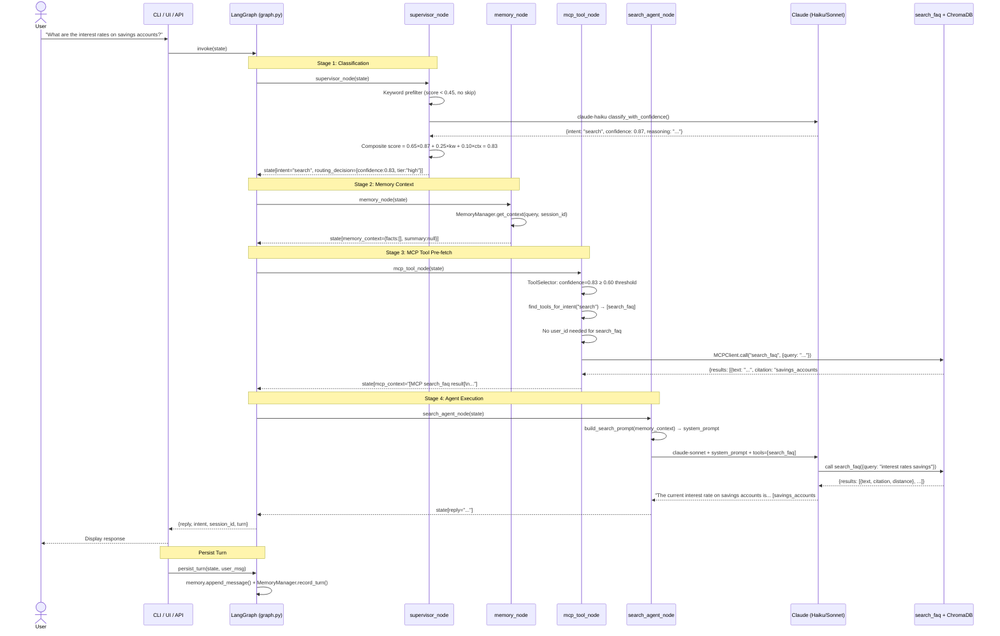
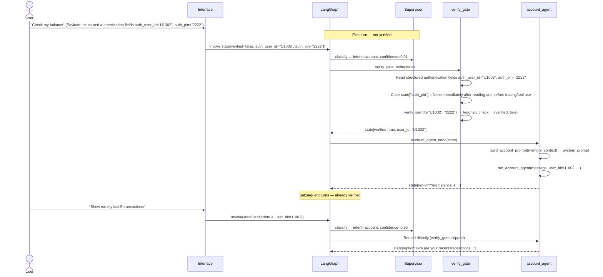
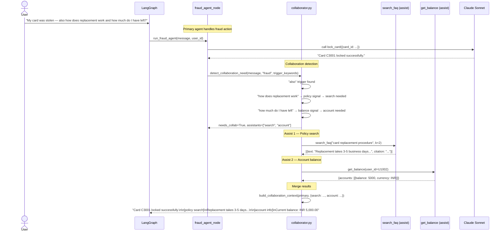
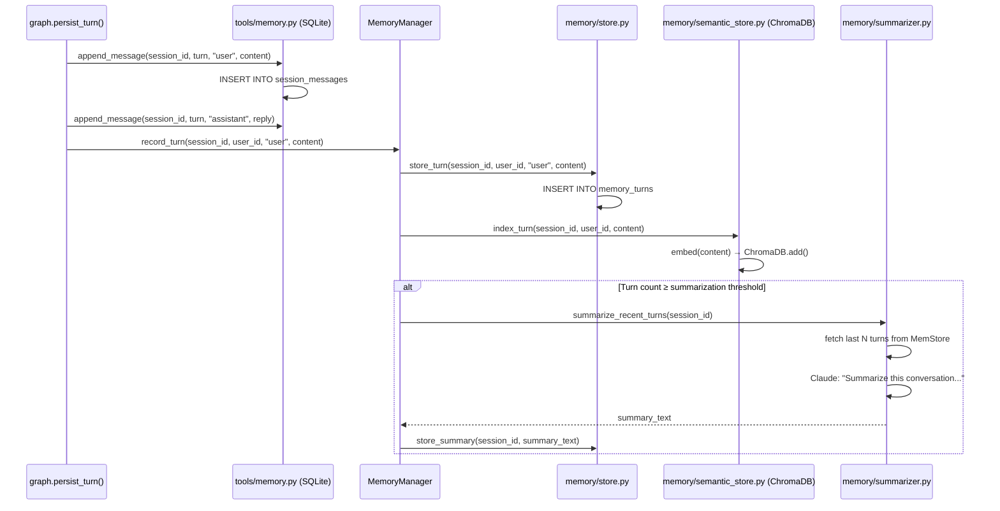
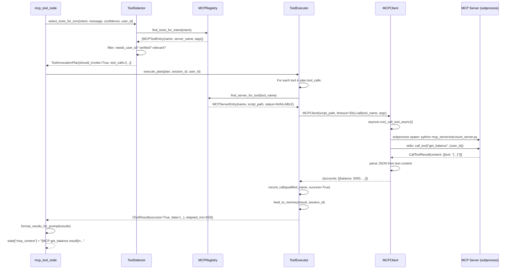
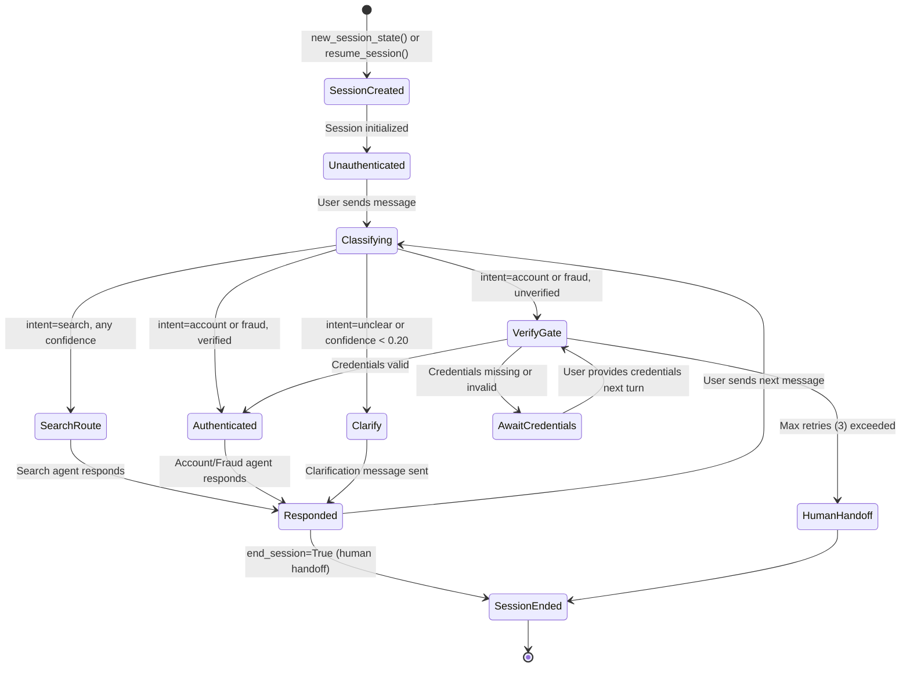

# Sequence Diagrams

> Detailed interaction sequences for the key flows in the Autonomous Banking Assistant.

---

## 1. Standard User Request (Search Intent)

---

## 2. Authenticated Request (Account Intent)

---

## 3. Multi-Agent Collaboration

---

## 4. Memory Write Flow

---

## 5. Tool Execution Flow (MCP)

---

## 6. Conversation Lifecycle

